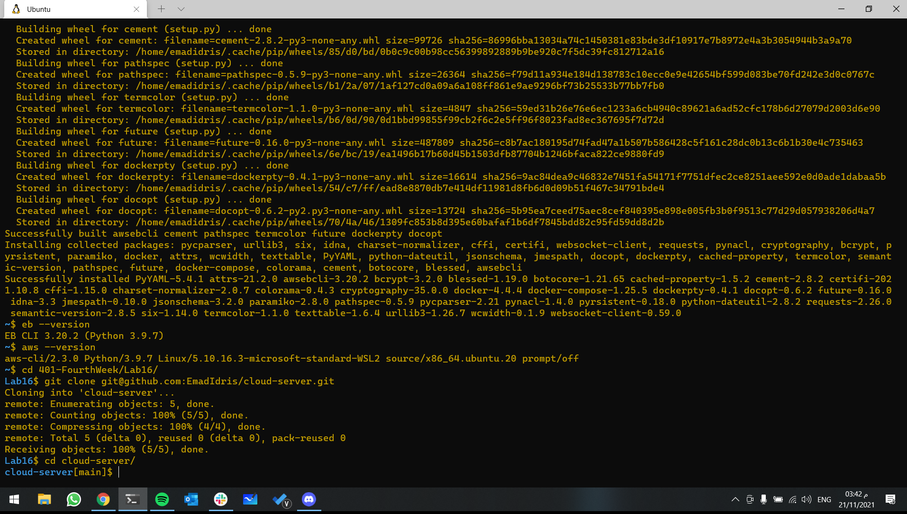

## Project: Cloud Based basic-api-server

### Author: Emad Idris

***

### Links and Resources

[Pull Request](https://github.com/EmadIdris/cloud-server/pull/1)

#### `.env` requirements

- `PORT` - Port Number

***

To run application:

`npm start`

***
# Deploy

# 
